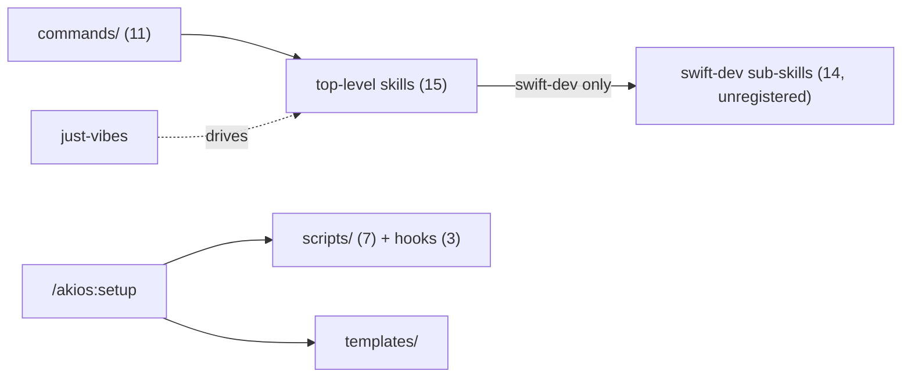

# akios Plugin Architecture — Audit Map

Snapshot of `akios` v0.8.0 (branch `master` @ `5ea090e`). Generated for architecture audit —
identify noise/overlap before pruning. Companion files: `plugin-architecture.mmd` (raw diagram
source) and `plugin-architecture.html` (rendered, browsable).

## 1. Manifest layer

| File | Role |
|---|---|
| `.claude-plugin/marketplace.json` | Registers the `akios` plugin entry the marketplace serves. One plugin, `source: "./"`. |
| `.claude-plugin/plugin.json` | Plugin identity + `version` (0.8.0). Must stay in sync with `VERSION` + `CHANGELOG.md` on every release (standing rule). |

## 2. Commands (11) → skill loaded → role

| Command | Skill loaded | Role | Notes |
|---|---|---|---|
| `/akios:setup` | — (no skill; direct file ops) | Bootstrap | Not a pipeline phase. Materializes `CLAUDE.md`, `AGENTS.md`, `akios/Context.md`, `akios/Roadmap.md`, `akios/specs/`, `akios/tasks/`, `akios/archive/`, hooks, templates. |
| `/akios:brainstorm` | `idea-to-spec` | Pipeline phase 1 | → `akios/specs/*.md`, status `designed`. |
| `/akios:plan` | `spec-to-tasks` | Pipeline phase 2 | → `akios/tasks/todo/*.md`, status `planned`. |
| `/akios:design` | `ui-variations` (+ `align-ui`) | Pipeline phase 3 (UI-scoped only) | Non-UI tasks skip straight to `deliver`. |
| `/akios:deliver` | `task-execution` | Pipeline phase 4 | → `akios/tasks/done/*.md`, status `done`. Routes Swift work into `swift-dev`. |
| `/akios:deep-brainstorm` | `deep-brainstorm` | Run-style (pre-execution) | Whole-app mapping → spec family. Optionally invokes `founderlens-behavior`. |
| `/akios:just-vibes` | `just-vibes` | Run-style (over the pipeline) | Drives brainstorm→plan→design→deliver unattended; waives the human push/merge gate only. |
| `/akios:learn` | `knowledge-ingest` | Maintenance | Not a phase. Delegates extraction to `oss-first`/`pdf`/etc. |
| `/akios:new-skill` | `skill-author` | Maintenance | Not a phase. Scaffolds + self-registers a skill or knowledge-pack. |
| `/akios:handoff` | `handoff` | Maintenance | Not a phase. Cross-session continuity doc. |
| `/akios:review` | `swift-dev/skills/review-doctrine` (+ built-in `/code-review`) | Maintenance | Thin wrapper: loads doctrine, then delegates to the built-in reviewer. |

`akios/workflow.yml` is the single declared source of truth for phases/prereqs/outputs — commands
deliberately don't re-document it.

## 3. Top-level registered skills (15)

Registered means: listed in `scripts/install-skills.sh`'s `SKILLS=(...)` array, which is what
actually ships to `~/.claude/skills/`.

| Skill | Version | Purpose (one line) |
|---|---|---|
| `idea-to-spec` | 1.2.0 | Idea → versioned spec, decision-by-decision. |
| `oss-first` | 1.0.0 | Prefer mature OSS tooling over hand-generated code for commodity problems. |
| `ios-feature-pipeline` | 3.0.0 | Orchestrator: routes a raw feature idea through `akios/workflow.yml`'s phases. |
| `ios-agentic-kit` | 2.0.0 | Meta-doc: what the kit installs, how it routes, how to set it up. |
| `spec-to-tasks` | 2.0.0 | Spec → `akios/tasks/todo/*.md` backlog, single pass. |
| `task-execution` | 2.2.0 | Drives the backlog to implemented/committed/reviewed code. |
| `swift-dev` | 1.1.0 | Router for all Swift/iOS work; bundles 14 sub-skill guides (§4). |
| `deep-brainstorm` | 1.0.0 | Whole-app Double Diamond mapping → spec family. |
| `founderlens-behavior` | — | Virtual co-founder persona for the first-diamond (Discover→Define) in chat. |
| `align-ui` | 1.0.0 | Pre-implementation UI decision gate; produces ground truth for `task-execution`. |
| `ui-variations` | 1.0.0 | Design-phase #Preview explore → remix → graduate loop. |
| `knowledge-ingest` | 1.0.0 | Raw material (PDF/code/image/docs) → knowledge pack. |
| `just-vibes` | 1.1.0 | Unattended run-style over the whole pipeline. |
| `handoff` | 1.0.0 | Compact a session into a handoff doc for another session. |
| `skill-author` | 1.0.0 | Scaffold + self-register a new skill or knowledge-pack shell. |

## 4. `swift-dev` bundle — 14 nested sub-skills (NOT separately registered)

These live under `skills/swift-dev/skills/<name>/GUIDE.md` and ship as part of `swift-dev` via
`cp -R` — they have no independent entry in `SKILLS=(...)`, no independent version, and (per
`.gitignore`'s comment) some look vendored rather than authored (`swift-concurrency-pro` and
`swift-testing-pro` carry their own `CODE_OF_CONDUCT.md`).

| Sub-skill | GUIDE.md size | Has `agents/` | Has `assets/` |
|---|---|---|---|
| `alva-architecture` | small | — | — |
| `figma-to-swiftui` | small | — | — |
| `ios-accessibility` | small | ✓ | — |
| `ios-debugger-agent` | small | ✓ | — |
| `review-doctrine` | small | — | — |
| `swift-concurrency-pro` | small | ✓ | ✓ |
| `swift-testing-pro` | small | ✓ | ✓ |
| `swiftdata-pro` | small | ✓ | ✓ |
| `swiftui-design-principles` | **627 lines** | — | — |
| `swiftui-design-system` | 95 lines | — | — |
| `swiftui-performance-audit` | 106 lines | ✓ | — |
| `swiftui-pro` | 108 lines | ✓ | ✓ |
| `swiftui-ui-patterns` | 103 lines | ✓ | — |
| `swiftui-view-refactor` | 202 lines | ✓ | — |

Six of the fourteen (`swiftui-design-principles`, `swiftui-design-system`, `swiftui-pro`,
`swiftui-ui-patterns`, `swiftui-view-refactor`, `swiftui-performance-audit`) all cover
SwiftUI-shaped ground with no stated boundary between them in `swift-dev/SKILL.md`'s router
table — candidate for a closer read (§7).

## 5. Scripts (7) + Hooks (3)

| Script | Purpose |
|---|---|
| `scripts/install.sh` | Plugs the kit into a target repo (used by `/akios:setup`). |
| `scripts/install-skills.sh` | Installs the authored `SKILLS=(...)` array into `~/.claude/skills/`. Source of truth for what's registered. |
| `scripts/check-update.sh` | Checks whether a project's install is behind the kit clone. |
| `scripts/akios-instance.sh` | Stable per-instance identity for multi-instance claim etiquette (team mode). |
| `scripts/alva-usage-ledger.sh` | ALVA Foundation usage ledger — grep + git-hook strategy. |
| `scripts/register-skill.sh` | Idempotently adds a new skill to `install-skills.sh`'s array. |
| `scripts/test-kit.sh` | Sanity check: authored skills + install templates present and well-formed. |

| Hook (`scripts/hook/`) | Trigger | Purpose |
|---|---|---|
| `agentic-kit-inject.sh` | `SessionStart` | Re-states default skill gates + discovers knowledge packs each session. Reminds, doesn't enforce. |
| `post-checkpoint-verify.sh` | Called by `task-execution` at `[major]` checkpoints | Auto build/test proof; not wired to a Claude Code event directly (too slow per-tool-call). |
| `skill-trace.sh` | `PostToolUse` | Appends a JSON trace line to `akios/.local/trace.jsonl` on skill/reference reads. |

## 6. Templates (`templates/`)

Materialized into a consumer repo by `/akios:setup`: `AGENTS.md`, `CLAUDE.md`, `akios/Context.md`,
`akios/Roadmap.md`, `akios/Vision.md`, `preferences.seed.md`, `spec.md`, `task.md`, `rules/swift.md`
(the swift gate), `foundation/DesignSystem.swift`, `foundation/RoleModifiers.swift`.

## 7. Diagram

See `plugin-architecture.mmd` for the full source (render at mermaid.live) or
`plugin-architecture.html` for a browsable version. Abbreviated view:

## 8. Audit flags — resolved

Originally logged as observations, not verdicts. Each was checked against the actual file
contents in a follow-up pass; verdicts below.

1. **Meta-documentation overlap — closed, false alarm.** `akios/Context.md`, `README.md`,
   `ios-agentic-kit`, and `ios-feature-pipeline` serve different audiences (repo-self-context,
   GitHub visitor/install, kit onboarding, in-flight phase routing). `ios-agentic-kit` carries
   only a one-line phase-spine summary that points to `ios-feature-pipeline`'s full table — that's
   layering, not duplication. No merge warranted.
2. **`swiftui-*` sub-skill sprawl — closed, false alarm.** `swift-dev/SKILL.md`'s router table
   already documents explicit per-guide boundaries, "Selection rules," and a "Common combos"
   table. The 627 lines in `swiftui-design-principles` vs. 95–108 in its neighbors is scope
   (a full design-philosophy guide), not redundancy.
3. **Vendored-looking `CODE_OF_CONDUCT.md` — confirmed, actioned.** Present in
   `swift-concurrency-pro` and `swift-testing-pro`, referenced nowhere else in the repo. Removed.
4. **`align-ui` outside `akios/workflow.yml`'s `phases:` list — closed, false alarm.** It's documented
   by design as a gate inside the `design` phase's own comment block, not a missing phase.
5. **`commands/review.md` "two-line wrapper" — closed, false alarm.** It loads real doctrine
   (graduated block/warn severity, ledger-driven DRY via `Foundation/usage-ledger.json`, non-ALVA
   repo degradation) that the built-in `/code-review` has no way to replicate on its own.
6. **`tasks.md` (root) — confirmed, actioned.** The file itself no longer exists (fully migrated
   into `akios/tasks/todo/`). `akios/Context.md`'s Gotchas section still described it in the present tense;
   corrected to past tense.
